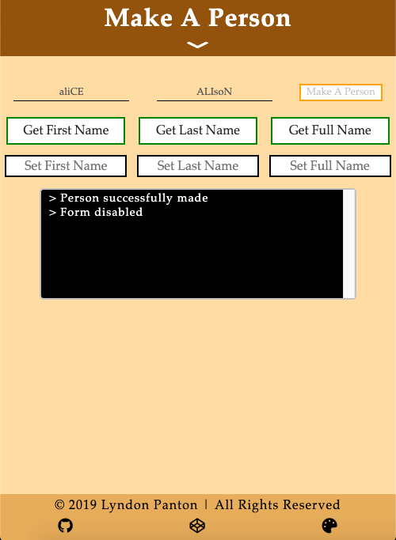
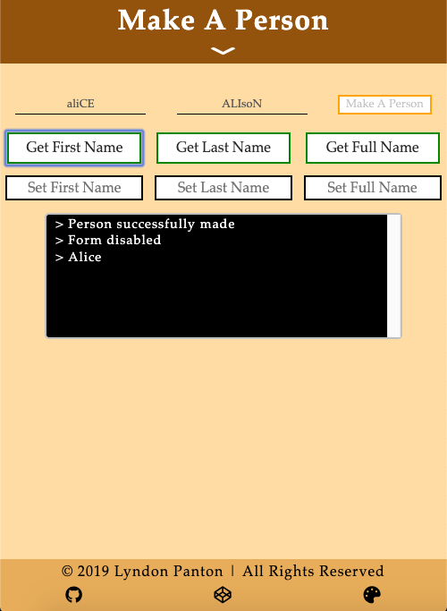
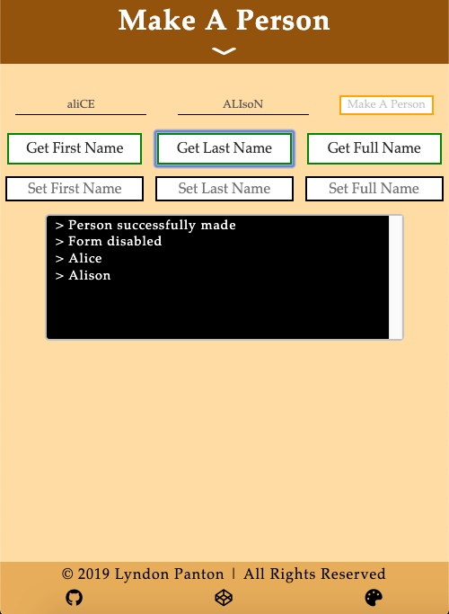
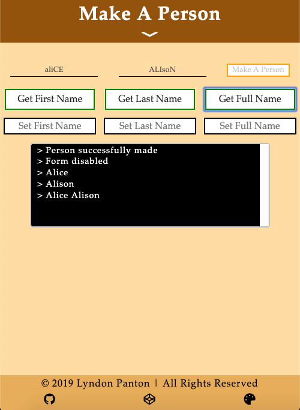
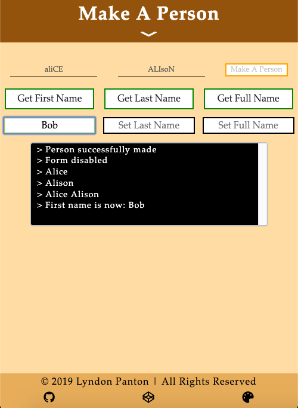
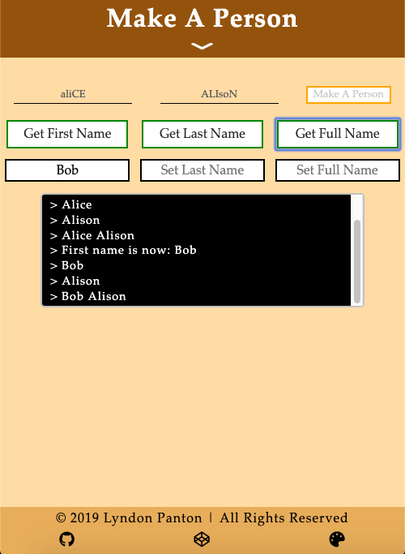
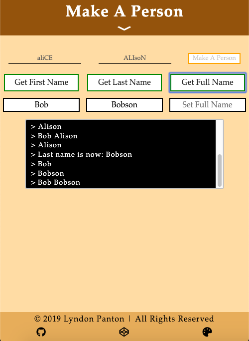
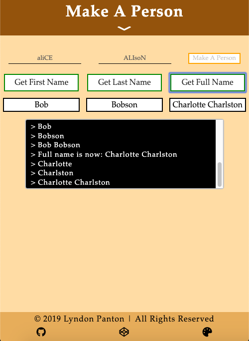

# Make A Person

## How To Open
> 1. Go to the application's download folder
> 2. Right click on the file named _index.html_
> 3. Choose the _open with_ option
> 4. Open the application in your desired browser

## How To Use
> 1. Enter first name into first input field
> 2. Enter last name into second input field
> 3. Press the _Make A Person_ button
> 4. You can now get information about the person made using the *Get* buttons
> 5. Enter (a) new  name(s) input to *Set* input fields to change the name of the person

## Requirements
> 1. This application requires a browser to run
> 2. The browser must have JavaScript available and enabled

## Errors
> 1. N/A

## Extra Information
> 1. This was done for one of the activities in freecodecamp's Intermediate Algorithm Scripting section

## Preview

